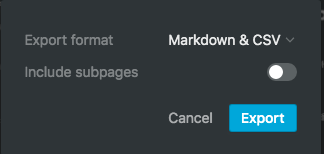

## Notion-to-GitHub-Pages란?

Notion에서 작성한 노트를 GitHub Pages 기반(jekyll) 블로그에 맞게 변환하여 자동으로 업로드해주는 어플리케이션입니다.

- Notion 2.0.7 버전에 최적화되어 있습니다.

## 기능

- Notion에서 export한 markup 파일 및 이미지 파일을 GitHub Pages에서 주로 이용하는 Jekyll서비스의 폴더구조에 맞게 이름 및 경로를 자동 변환해줍니다.
- 변환된 파일을 Git에 add시켜줍니다.

## 이용방법

1. *notion_to_github.sh* 파일을 다운로드하여, 본인 local PC의 GitHub Pages root 폴더(이하 *GitHub Pages root*)로 옮깁니다.
2. Notion app에서 GitHub Pages에 업로드하고자 하는 Notion 노트를 *Markdown & CSV* 형식으로 export합니다.

    

3. Notion에서 export한 zip 파일을 본인 local PC의 *GitHub Pages root* 경로로 옮깁니다.
4. Local 컴퓨터의 Shell에서 *GitHub Pages root* 경로로 이동 후, 다음을 입력하여 *notion_to_github.sh* 파일을 실행합니다.

        bash notion_to_github_pages.sh

5. 화면 설명에 따라 jekyll 메타정보(subtitlem categories, tags)를 입력합니다.
6. 잘 업로드 되었는지 확인합니다.

## 업데이트 사항

### V0.2(예정)

- image를 포함하지 않고 있는 Notion 노트도 이용 가능(예정)
- 추가 인자 받아 사용자 원하는 메타데이터 추가 기능(예정)

### V0.1(현재)

- 한 번에 여러 노트를 업로드하고 싶다면 각각의 노트를 개별 export하여 파일을 만들어야 합니다.
- image를 하나라도 포함하고 있는 Notion 노트만 이용 가능합니다.
