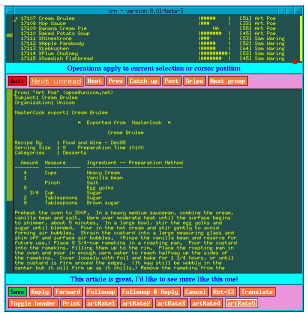

**Table of contents**

## 추천 시스템이란

세상에는 수많은 정보가 존재한다. 특히 인터넷의 등장으로 매일매일 이전의 데이터를 모두 합친것보다 많은 데이터가 쌓이고 있다. 이 중 **특정 사용자**가 **관심을 가질 만한 정보**를 찾아 추천하는 것이 추천시스템이라 할 수 있다. 일종의 Information filtering이다.

3R : Delivering the Right Contents to the Right user at the Right moment

우리가 매일하는 검색도 일종의 추천시스템이라 할 수 있다. 검색과 추천 모두 user에게 relevent data를 주는건 동일하지만 user가 표현한 intent에 대해 정보를 제공하는지, 이를 초월해서 제공하는지 차이

- **검색(**Information Retrieval) : query와 document 사이의 관계를 분석
사용자의 명시적 물음 행위(query를 던지면)에 대해 document list를 반환. Ad-hoc information need
- **추천(Recommendation)** : user와 item 사이의 관계를 분석
사용자의 명시적 행위가 없어도 사용자의 이전 행동을 기반으로 관심 있을만한  아이템 리스트를 반환. stable  information need

query를 user라 보고 document를 item이라고 본다면 검색과 추천은 상당히 유사한 프로세스라 할 수 있다. learning to rank 라는 task는 검색과 추천 모두에 활용된다. 뿐만 아니라 실제 상황에서는 서로 맞물려서 돌아가는 분리하기 어려운 행위이다. 사용자는 검색과 추천을 iteration하며 사용하면서 좋아할만한 아이템을 찾아간다. 유튜브의 예를 들면 검색 버튼을 통해 원하는 동영상을 찾을 수도 있고 메인 피드에서 재미 있을만한 동영상을 클릭해서 볼 수 있다. 혹은 검색을 통해 나온 아이템을 선택하면 그 아이템과 비슷한 아이템을 추천할 수도 있다.

'**사용자**가 **관심을 가질 만한 정보'에서** '관심'을 무엇으로 정의하냐는 추천 알고리즘과 추후 추천이 잘 됐는지 여부를 평가하는 기준이 된다. 아이템의 종류가 동영상이라면 동영상을 시청하는 것이, 쇼핑 관련 제품이라면 구매나 장바구니에 넣는 것이 관심을 나타낸다. 얼마나 관심을 가지는지도 정의하기 나름이 된다. 유튜브에서는 동영상을 시청한 시간을 관심의 척도로 사용한다.

조금더 실제적인 정의는

[https://yamalab.tistory.com/67?category=747907](https://yamalab.tistory.com/67?category=747907)

추천시스템에 대한 정의를 찾던 도중, 가장 인상적인 문구를 보았다. 추천 시스템, 혹은 추천 모델링은 **'특정 시점'에 '특정 고객'이 좋아할 만한 리스트를 찾아주는 것**이라는 문구였다. 무언가 시사점을 제시하는, 기술개발에 집착하는 나 일부 개발자들에게 교훈이 되는 말인 것 같다. 예를 들어보자. 남북회담이 열리던 시점에서의 뉴스를 추천받고 싶을 때, 아무리 협업 필터링에 기반한 state of the art에 가까운 알고리즘을 사용하여 평소 관심사에 기반한 뉴스들을 추천한다고 한들 내가 지금 시점에서 좋아 할 만한 뉴스, 종전 선언에 관련된 뉴스를 보고싶어한다는 사실을 알지 못한다면 의미가 없다. 포털 페이지에 지금 내가 보고 싶은 뉴스가 떠있지 않다면, 충성도가 높지 않은 고객은 쉽게 그 페이지를 떠날 수 있다.

그래서 특정 시점에 특정 고객이 원하는 리스트를 찾기 위해 우리는 고객의 정보를 살펴보고, 가지고 있는 전체 리스트(아이템)을 살펴보고, 때로는 시스템 외부의 정보들을 끊임없이 살펴보면서 이를 리스트에 반영할 수 있는 시스템을 만들어야 한다.

## 역사

- Ants, Cavemen, and Early Recommender Systems

    다른 사람의 얘기를 듣고 그대로 따라하던 시절.

- Information Retrieval

    배경 : 정보가 추가되는 양은 적은데 반해(Static content base) query 다양성이나 날리는 빈도가 잦음(Dynamic information need). 예:도서관

    따라서 기존 정보들을 indexing하여 db를 만드는데 시간을 많이 투자하여, query에 대해 실시간으로 답변하는데 주력. 그 예가 CBF의 TF-IDF

    – Rank documents by term overlap
    – Rank terms by frequency

- Information(contents) Filtering

    배경 : 하지만 현대로 올수록 새로운 정보 생산 속도가 급격히 상승 →  IR과 반대 assumtion. 즉 Static information need, Dynamic content base

    이에 따라 개별 유저들의 프로필을 모델링하는데 역량을 집중하고 이 필터를 통해 새로운 콘텐츠 중 개개인에 맞는 정보를 가려 제공하는데 초점

- Collaborative Filtering

    배경: 하지만 **단순히 IR로 특정 topic에 대한 relavance가 높은것만 보고싶어하는게 아니라  quality and taste, 즉 해당 토픽 안에 퀄리티가 높고 내 취향과 맞는** 기사를 보고싶어하는 니즈

    초기에는 이를 사람들의 커뮤니티 기반으로 manual하게 풀어냄(누가 이 콘텐츠를 좋아할 것인가를 사람들이 일일히 체크)

    그러다 90년대 초, GroupLens Project (CSCW ’94)라는게 시도됨(원리는 CF와 완전 동일. 뉴스에 대해 평가하게 하고 그 평가와 유사하게 평가한 다른 사람이 높게 평가한 뉴스를 추천)
    미국 미네소타대학 컴퓨터공학과에서 개발한 그룹렌즈(GroupLens)는 1994년부터 이용자 기반 협업 필터링(User-user Collaborative Filtering) 알고리듬을 사용하여 유즈넷(Usenet)에서 뉴스를 추천해왔
    다.
    assume stable tastes

    

이게 발전해 90년대 중반부터 드디어 commercial 시장에 적용되기 시작

• Non‐Personalized and Stereotyped
– Popularity, Group Preference, stereotype
• Product Association
– People who liked/bought X, also like Y. 이건 개인화가 아닌 그 순간에 그 사람이 좋아하는 것에 대해 다른 걸 추천해주는 방식
• Content‐Based : 개인화의 시작
– Learn what I like (in terms of attributes)
• Collaborative
– Learn what I like; **use others’ experience** to recommend. 일종의 community 이용

**2. 추천 시스템이 고려할 요소**

서비스 관점에서 추천 시스템을 구축, 개발하는 입장에서 고려할 요소는 크게 4가지 정도이다. 추천 시스템은 거의 대부분의 경우 B2C 비즈니스 환경에서 적용된다. 그래서 당연하게도 고객, 아이템을 고려해야 하고 추가적으로 **시스템의 업데이트**와 추천 시스템의 **알고리즘적 성능**을 고려해야 한다.

시스템의 업데이트를 고려한다는 것은 얼마나 자주 추천되는 아이템의 리스트가 업데이트 되는 지에 대한 것이다. 앞서 언급했던 남북회담이 열리던 시점에서의 뉴스 추천의 상황을 생각해볼 때, 추천의 영역마다 아이템 리스트의 업데이트가 얼마나 빠른 주기로 이루어지는지가 매우 중요할 것이다.

추천 시스템에서의 알고리즘적 성능이란, 좁은 의미에서는 추천 모델의 계산량이나 연산 속도를 의미한다. 현재 state of the art의 취급을 받고 있는 CF(Collaborative Filtering)이나 DL(Deep Learning)의 경우 다수의 Hadoop Cluster 환경 등의 빅데이터 시스템이 안정적으로 구축되어 있지 않은 한, 좋은 알고리즘적 성능을 가진 모델은 아니라고 할 수 있다. 이 때문에 최신의 알고리즘보다는 훨씬 쉽고 간단하면서도 연산량이 작고, 그럼에도 불구하고 고급 알고리즘들과 비슷한 성능을 낼 수 있는 Association Rule과 같은 알고리즘들이 e-commerce 영역에서는 여전히 널리 활용되고 있다.

또한 넓은 의미에서의 알고리즘적 성능은 빅데이터를 처리할 수 있는 좋은 환경을 의미한다. 대부분의 추천 시스템은 대량의 정보를 이용하여 추천하는 B2C 비즈니스 모델이기 때문이다. 연산량이 적은 알고리즘을 사용한다고 해도, 수 많은 고객들이 이용하는 시스템의 경우에는 좋은 환경을 구축하지 못했다면 장애가 생길 여지가 많다.

**3. 추천 시스템의 장애 요소**

추천 시스템에서의 가장 널리 알려진 장애 요소는 **Sparsity Problem**이다. 추천할 아이템과 고객은 계속해서 늘어난다. 이에 따라 고객이 실제로 소비하게 되는 콘텐츠나 아이템의 비율은 현저하게 감소하게 된다. 이를 알고리즘적인 관점에서 Sparsity Problem이라고 한다. 차원의 저주를 생각하면 될 것이다. 물론 어느정도의 임계치는 있겠지만 서비스가 성장하는 단계에서는 더욱 심하게 나타나는 현상이다. 특히나 e-commerce 같은 영역에서는, 인기 상품이나 카테고리는 한정되어 있지만 서비스의 양적 향상은 끊임없이 일어난다. 지금처럼 소비의 헤게모니가 오프라인에서 모바일로 거의 다 옮겨가는 상황에서는 대부분의 서비스가 양적 팽창이 일어나고 있기 때문에 한 번쯤은 겪어볼만한 문제라고 할 수 있다. 디지털 환경에서는 '추천'이라는 타이틀을 달고 리스트가 노출되는 영역이 한정적이기 때문에 아이템의 리스트를 추려내는 작업은 더더욱 어려워진다. 그래서 추천 시스템에서의 기술적 발전은 대부분 이 문제를 해결하는 것을 염두에 두고 있다.

다음으로, 영화 추천이나 맛집 추천 서비스가 아닌 대부분의 추천 서비스에서 나타나는 문제점인 **Information Utilization Problem**이 있다. 이는 추천 시스템 구축에 활용하기 위한 데이터, 정보들을 올바르게 활용하기 위한 고민에서 나온 문제점이라고 할 수 있다. 이를 이해하기 위해 e-commere에서의 추천 시스템에서 고객의 행동을 생각해보자. 대부분의 고객들은 상품을 눌러보고, 다른 상품도 살펴보고, 본인 기준에 마음에 든다면 장바구니에 넣어뒀다가 이를 구매하기도 한다. 이런 정보들을 Implicit Score(암묵 점수)라고 한다.

왓챠나 넷플릭스 같은 영화 추천 서비스에서처럼, 사용자들은 아이템에 대한 명확한 평가를 내리지 않는다. 단지 상품을 눌러보고, 관심 표시를 하거나 구매 하는 정도이다. 상품에 대한 리뷰를 작성하거나 별점을 주는 고객은 극소수에 가깝다. 이러한 로그 데이터 속에 숨어있는 정보를 이용하는 고민이 필요하다. 하지만 이것이 쉽지 않기 때문에 Information Utilization Problem 이라고 부르는 것이다. 만약 고객의 구매 목록 데이터가 있을 때, 구매가 완료되었다고 과연 이 데이터가 상품에 대한 호감을 나타내는 데이터라고 할 수 있을까? 환불이나 교환이 일어났다면? 이 모든 것을 고려하여 데이터를 활용하기 용이한 Explicit Score(명시 점수 : 영화 평점에 대한 rating 같은 점수)처럼 데이터를 Utilization 하는 과정이 필요할 것이다.

그렇다고 Explicit Score가 항상 좋은 데이터인 것은 아니다. 대부분의 잘 정리된 명시 점수의 경우 Sparsity Problem을 심각하게 겪을 것이다.

# 참고 자료

[당근마켓 머신러닝 엔지니어 이웅원- 추천시스템 Basic(2019.08.13)](https://www.notion.so/Basics-4487ed5d90f94ad490879401c7801293#9ebba81ff04f4e91872a400298a29e4e)

[Coursera | Online Courses From Top Universities. Join for Free](https://www.coursera.org/learn/recommender-systems-introduction/home/welcome)
